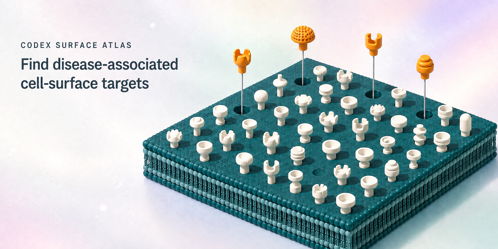
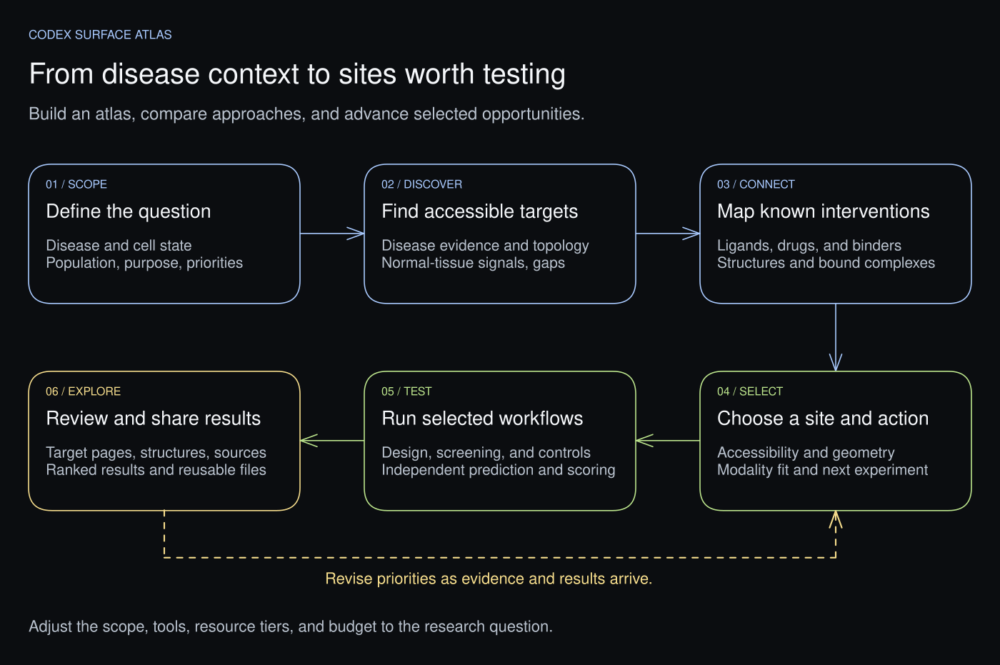
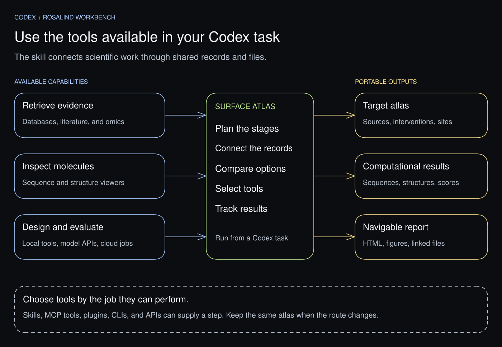

# Codex Surface Atlas

Identify cell-surface targets in a disease state, compare accessible binding
sites, and select targets for screening or binder design.

Use Rosalind Workbench plugins in Codex to search disease and tissue data,
retrieve supporting studies, inspect structures, and run selected screening or
binder-design workflows. Each target's report page shows its cell population,
normal-tissue expression, known treatments, sequences, structures, results,
and source files.

```text
disease state + cell population
  -> surface-target census
  -> disease and normal-tissue evidence
  -> target, action, modality, and accessible site
  -> molecule screening or binder design
  -> target pages, results, and source files
```

```text
Use Codex Surface Atlas to find cell-surface targets in [disease] for payload
delivery or imaging. Compare disease and normal-tissue evidence, inspect
accessible binding sites, and build a report with the supporting sources.

Use Codex Surface Atlas with this supplied ligand library. Separate known
target relationships from proposed interactions, then select binding sites
with suitable structures and controls for screening.

Use Codex Surface Atlas to turn this existing atlas into a compact report
with target pages, cited evidence, structures, and downloadable result files.
```

Start with a disease state, a supplied molecule library, or an existing atlas.
Choose which targets to investigate and which tools to use.

## Included in the package

| Installed capability | What you can do offline |
| --- | --- |
| [Complete replay tutorial](docs/tutorial.md) | Reproduce reviewed synthetic queries, deduplication, exclusions, unresolved records, sites, controls, and an assay return. |
| [Evidence intake](docs/evidence-intake.md) | Compile supplied source snapshots into a new atlas and check the census against its hashed sources. |
| [Action comparison](docs/action-comparison.md) | Switch between payload delivery, blockade, and imaging; inspect the source basis, missing criteria, and next measurement. |
| [Sequence and sites](docs/sequence-sites.md) | Select a sequence interval, inspect verified PDB residue mappings in 3D, and export FASTA or a portable Codex request. |
| [Campaign and assay intake](docs/research-intake.md) | Preserve independent runs, exact constructs, lineage, controls, failed gates, units, replicates, and censored measurements. |
| Reports and reviewed exports | Build linked HTML, JSON, CSV, and coordinate downloads; check file integrity and exact export inventories. |

Evidence retrieval, model execution, and experimental submission use separately
installed plugins or companions. The CLI does not launch those services.
This is alpha research software: recorded source support and computational
results do not establish clinical suitability.

## Work with Rosalind plugins

The [recipe guides](docs/recipes/README.md) show what to give Codex, which plugins
to use, and what each step adds to the atlas.

| What you want to do | Start with these plugins |
| --- | --- |
| Find disease-associated surface targets and supporting studies | Life Sciences Databases and Life Sciences Literature |
| Compare disease and normal cell populations | Life Sciences Databases for datasets; NGS Analysis Workbench for analysis |
| Inspect sequences, extracellular domains, structures, and binding sites | Life Sciences Databases, Biological Sequence & Alignment Viewer, and Molecular Structure Viewer |
| Compare known ligands and screen a supplied library | Life Sciences Databases and NVIDIA BioNeMo Agent Toolkit |
| Design and evaluate protein binders | NVIDIA BioNeMo Agent Toolkit and Biohub ESM, with Codex Binder Lane for campaign orchestration |
| Prepare experiments and collect measurements | Adaptyv Bio |

Combine recipes around the target and molecule format you want to investigate.
For example, use CELLxGENE to locate a relevant dataset, NGS Analysis Workbench
to compare cell populations, UniProt and RCSB PDB to inspect a selected target,
and BioNeMo to evaluate molecules at its extracellular site.

Each recipe keeps the selected target, site, and source records connected.
Local preparation, hosted models, and cloud workers appear where the workflow
needs them. [Integrations](docs/integrations.md) lists the source databases and
the roles of [Proteus](https://github.com/jvogan/proteus),
[Codex Binder Lane](https://github.com/jvogan/codex-binder-lane), and
[BioSymphony Structure Factory](https://github.com/BioSymphony/structure-factory).



[Edit this figure in Excalidraw](docs/figures/workflow.excalidraw).

## What the atlas records

- disease, cell population, searched sources, and retrieval dates;
- retained targets, exclusions, and unresolved identities;
- disease relevance, surface accessibility, and normal-tissue evidence for each target;
- known interventions and proposed interactions, with their evidence labels;
- experimental and predicted structures, complexes, constructs, and residue maps;
- selected targets, intended actions, molecule formats, binding sites, and supporting reasons;
- screening and binder-design inputs, controls, results, and failed runs;
- linked report pages, JSON and CSV records, citations, and file checksums.

Read [the workflow](docs/workflow.md) for the stages and decision points, [evidence and decisions](docs/evidence-and-decisions.md) for evidence labels, and [the report guide](docs/report.md) for the delivered materials.

[Adversarial review](docs/adversarial-review.md) uses independent subagents to
check evidence, binding sites, controls, and report claims at key decisions.
It includes a prompt for parallel review and a process for resolving findings.

For independent screens, binder campaigns, or RNA cohort comparisons in one
workspace, read [Multiple runs in one atlas](docs/multi-run-research.md).

To share a completed report through a hosted URL, use the
[ChatGPT Site recipe](docs/recipes/chatgpt-site.md).

## Schemas

Versioned [JSON Schemas](schemas/v0.1/README.md) describe the portable plan, search ledger, and collection envelopes. The CLI validator performs the additional checks that require the complete workspace.

## Installation

Surface Atlas requires Python 3.10 or later. On macOS or Linux, create an
isolated environment and install the CLI from a source checkout:

```bash
python3 -m venv .venv
. .venv/bin/activate
python -m pip install --upgrade pip
python -m pip install .
surface-atlas --version
```

On Windows PowerShell, use the environment executables directly:

```powershell
py -m venv .venv
.\.venv\Scripts\python.exe -m pip install --upgrade pip
.\.venv\Scripts\python.exe -m pip install .
.\.venv\Scripts\surface-atlas.exe --version
```

For the remaining commands in PowerShell, replace `python` with
`.\.venv\Scripts\python.exe` and `surface-atlas` with
`.\.venv\Scripts\surface-atlas.exe`. Join commands split across lines into
one line, removing the trailing `\` characters.

To install a wheel you downloaded locally, replace the filename with the
downloaded artifact:

```bash
python -m pip install ./codex_surface_atlas-0.1.0-py3-none-any.whl
```

The CLI creates local workspaces, validates records, builds offline reports,
and checks or exports reviewed files. An agent task provides the evidence
sources, structure viewers, and companion workflows used for research.

Use the synthetic example below to check the CLI. Install the bundled skill
for the current project when you want the guided workflow:

```bash
surface-atlas install-skill \
  --destination .agents/skills/codex-surface-targets --json
```

For a user-wide Codex installation, use `~/.codex/skills/codex-surface-targets` as the destination instead. Start a new task after installation, then invoke `$codex-surface-targets` or describe the research question directly. The skill's workspace, validation, and report commands use the installed CLI. The installer refuses to overwrite a non-managed destination. See [Getting started](docs/getting-started.md) and the [CLI reference](docs/cli.md).

Virtual-environment activation applies to the terminal where you ran it. If a
new Codex task cannot find `surface-atlas`, give it the installed executable's
path. In the source checkout, that is `.venv/bin/surface-atlas` on macOS or
Linux, or `.venv/Scripts/surface-atlas.exe` on Windows.

## Start with the synthetic example

For the full workflow, run the [offline tutorial](docs/tutorial.md):

```bash
surface-atlas tutorial ./surface-atlas-tutorial --json
surface-atlas validate ./surface-atlas-tutorial --json
surface-atlas report ./surface-atlas-tutorial \
  --output-root ./surface-atlas-reports --run-id tutorial --json
```

All tutorial observations and measurements are explicitly synthetic. Its guide
lists expected counts, choices, hashes, and reproducible intake commands.

Run the synthetic example to check your installation and explore target pages,
structures, screening records, and downloads. All example records are invented.

```bash
surface-atlas example ./surface-atlas-synthetic --json
surface-atlas validate ./surface-atlas-synthetic --json
surface-atlas report ./surface-atlas-synthetic \
  --output-root ./surface-atlas-reports --run-id synthetic-demo --json
```

Open `./surface-atlas-reports/synthetic-surface-atlas/synthetic-demo/index.html` to explore the report.

## Explore a research example

The [three-target research example](examples/research-case/README.md) contains
selected records for CEACAM5, ITGB6, and FAP in mucinous colorectal
adenocarcinoma. It includes deposited structures, a prepared target, FAP docking
results with controls, and a CEACAM5 binder-design result that was not promoted
after its control assessment failed. This is a partial research example;
computed structures and scores remain hypotheses.

From the source checkout, build its report with the installed CLI:

```bash
surface-atlas validate examples/research-case --json
surface-atlas report examples/research-case \
  --output-root ./surface-atlas-reports --run-id research-case --json
```

Open `./surface-atlas-reports/research-case-example/research-case/index.html`.
The example includes the coordinates, sequences, figures, and checksums used
by the report. See [the report guide](docs/report.md) for structure previews
and [the release guide](docs/releasing.md) for a clean installation check.

## Optional companions

- [Proteus](https://github.com/jvogan/proteus) retrieves and inspects structures, maps residues and interfaces, and prepares PyMOL or ChimeraX figures.
- [Codex Binder Lane](https://github.com/jvogan/codex-binder-lane) plans binder campaigns for a selected target and site, evaluates candidates, and tracks each sequence to its backbone and predicted complexes.
- [BioSymphony Structure Factory](https://github.com/BioSymphony/structure-factory) prepares structural-biology campaigns across design, folding, scoring, screening, and rendering, with local or cloud execution plans and checked result files.

See [Integrations](docs/integrations.md) for the inputs and outputs to exchange
with each companion.



[Edit this figure in Excalidraw](docs/figures/tool-map.excalidraw).

For development setup, packaged-copy requirements, and checks, read
[Contributing](CONTRIBUTING.md).

## License and attribution

Created by [Jacob Vogan](https://github.com/jvogan). Copyright © 2026 Jacob Vogan. This project is released under the [MIT License](LICENSE). See [NOTICE.md](NOTICE.md) for third-party references and attribution.
