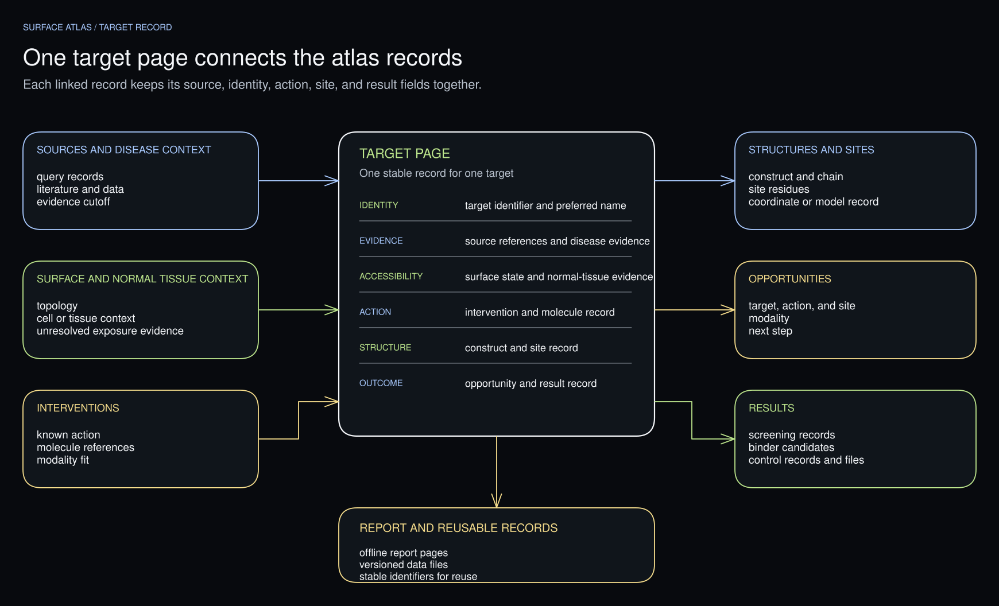

# Report and artifacts

Open a target page to compare its evidence, known interventions, structures,
and computational results. Follow the links to inspect source records and
download the underlying files.

To share the report through a hosted URL, follow
[Publish a report as a ChatGPT Site](recipes/chatgpt-site.md).

To tailor the report's comparisons, molecular views, and follow-up analyses,
use [Compare results and choose the next analysis](recipes/compare-and-continue.md).
That recipe asks Codex to extend the generated report for your project and
check the resulting interactions against the source records.

## Compact, navigable report

The overview summarizes the disease and target census. The target explorer
compares recorded scores and shows their contributing measurements. Select a
protein in **Target atlas**, then choose **Open target page** to inspect its
cell-population measurements, warning signals, interventions, and structures.
The measurements identify their source cohort and measurement type.

Each target page also collects its molecular screens, binder candidates, and
controls. Follow the result links to inspect scores, recorded decisions,
coordinates, and sequences. Evidence labels distinguish observed, derived,
inferred, and proposed results.



[Edit this figure in Excalidraw](figures/target-record.excalidraw).

## Inspect a selected structure

When a figure offers **View in 3D**, select it to open a local molecular
preview of its packaged PDB, mmCIF, or SDF coordinates. The report loads that
viewer only after you select it. You can open the static report directly from
its `index.html`. The preview needs a local HTTP server because browsers block
coordinate loading from `file://` pages:

```bash
python -m http.server 8000 --bind 127.0.0.1 \
  --directory ./surface-atlas-reports/ATLAS_ID/RUN_ID
```

Open [the local report](http://localhost:8000/) in a browser. The preview uses the packaged
coordinates and bundled viewer assets; it makes no external structure or
viewer requests. It retains the figure's source and evidence labels.

Select **Copy Codex request** beside a structure figure to create a request
for Codex's Molecular Structure Viewer. Review and paste it into a Codex task
where the report files are available. The request names the figure's files,
recorded hashes, chain labels, colors, and selections; a matching sequence is
included when the figure records one.

## Screening runs

The screening page groups observations by run, target, site, scoring function,
units, route, and model version. It displays the controls for each group before
the prospective observations. Source-run and confirmation details appear in
separate disclosures for each run.

Downloaded JSON for required collections retains the original collection fields,
including source runs, confirmation contexts, summaries, and input hashes. The
combined `data/atlas.json` stores this required-collection metadata alongside
its record collections. See [multiple runs in one atlas](multi-run-research.md)
for the merge workflow.

## Larger artifacts

For campaigns with large coordinate sets, raw matrices, or media, distribute
those files as separate downloads. List each file's location, type, size,
source, and checksum in the example's manifest. Keep the files needed to read
the report with the report itself.

## Example status

The synthetic example is a runnable installation and report demonstration. Its records are invented and clearly labeled as such.

The [research example](../examples/research-case/README.md) contains selected
CEACAM5, ITGB6, and FAP records for mucinous colorectal adenocarcinoma. It
includes deposited and prepared structures, FAP docking results with controls,
and a CEACAM5 binder-design checkpoint with no promoted candidate. Its coverage
is partial, and its computed structures and scores remain hypotheses.

Build it from the source checkout:

```bash
surface-atlas report examples/research-case \
  --output-root ./surface-atlas-reports --run-id research-case --json
```

Open `./surface-atlas-reports/research-case-example/research-case/index.html`.
The example's [artifact manifest](../examples/research-case/artifact-manifest.json)
lists the packaged coordinate, sequence, figure, and preview files with their
byte counts and SHA-256 values.

## Visual references

These editable figures explain the workflow:

- [Workflow map](figures/workflow.svg): target discovery, evidence review, and report assembly.
- [Research routes](figures/research-routes.svg): site selection, molecule screening, and binder design.
- [Tool map](figures/tool-map.svg): scientific tools and the records they contribute.

Editable sources: [workflow.excalidraw](figures/workflow.excalidraw), [research-routes.excalidraw](figures/research-routes.excalidraw), and [tool-map.excalidraw](figures/tool-map.excalidraw).
