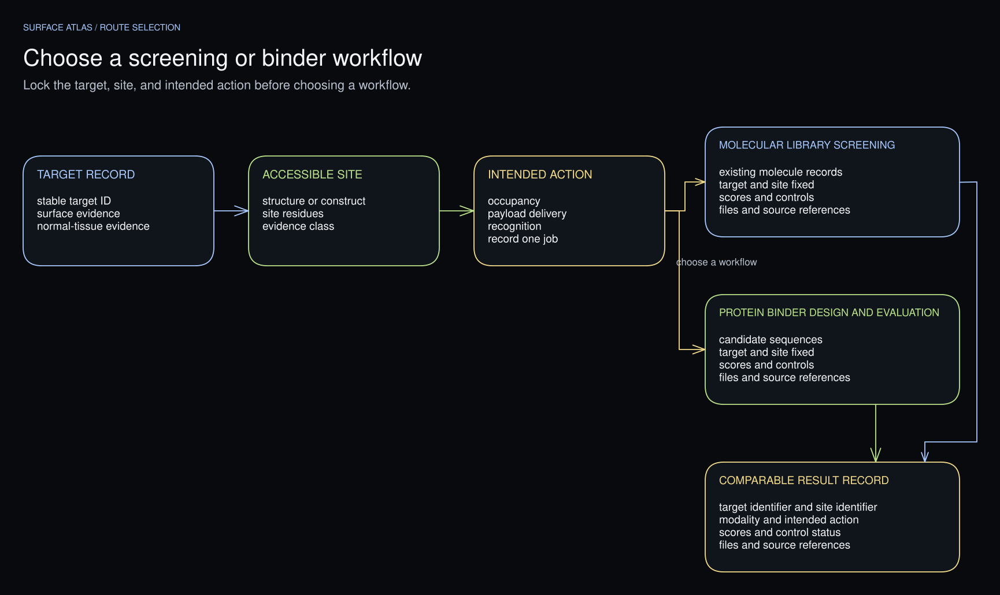

# Workflow

Build a surface-target census, compare known interventions, and inspect binding
sites before selecting molecules to screen or binders to design. You can stop
after the census or add the stages needed for your project. Record each target
selection and its supporting evidence.

```text
Disease-state biology
      ↓
Surface accessibility and cellular context
      ↓
Target census, evidence, and normal-tissue signals
      ↓
Known interventions and possible actions
      ↓
Structures, complexes, residue maps, and sites
      ↓
Target × action × modality choices
      ↓
Molecule screening or binder design
      ↓
Target pages, result tables, and source files
```



[Edit this figure in Excalidraw](figures/research-routes.excalidraw).

## 1. Record the disease and cell population

Record the disease state, organism, cell population, intended use, and evidence
cutoff. Specify the molecule formats to consider, available tools, compute
budget, and which data may be sent to external services.

## 2. Build a surface-target census

Search the registered source classes and retain each query and retrieval record
in `search-ledger.json`. Resolve each entry in `discovered-entities.json` into
a retained, excluded, or unresolved record. Check direct surface measurements,
topology, localization annotations, and the cell population studied. Record
which sources support each surface assignment.

Retain every target supported by the searched evidence. Apply the modeling
budget when selecting targets for detailed structure review and computation.

## 3. Keep evidence, risk, and modality fit separate

For each target, compare disease relevance, surface accessibility, and
normal-tissue expression. Evaluate the intended action and molecule format
against those findings. For example, internalization can favor payload delivery
while reducing the time a binder remains on the cell surface. Explain which
findings support each choice.

## 4. Map interventions and sites

Link known interventions to their sources and label proposed interactions and
computed poses as hypotheses. In `opportunities.json`, record the selected
target, intended action, molecule format, accessible site, supporting structure,
risks, missing measurements, and proposed analysis or experiment.

## 5. Compare structures and complexes

Label experimental structures and predicted models separately. Preserve the
source accession, construct, chains, biological assembly, residue map, and
coordinate hash. Show the selected site and any missing residues or partners
that affect its interpretation.

## 6. Screen molecules or design binders

Select a method suited to the target, construct, and site. Record its inputs,
controls, expected outputs, data destination, and budget; obtain any required
authorization before execution. Save the run settings, result files, failed
observations, and limits of the method. If the required tools or inputs are
unavailable, record what is needed to start.

## 7. Build the report

Build linked target pages with the evidence, structures, selected sites, and
results. Include local JSON and CSV downloads and a file manifest. See
[Report](report.md).
